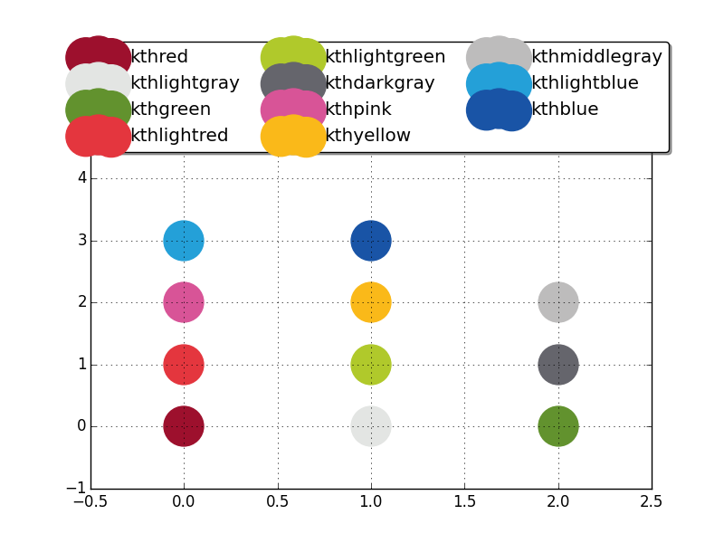

# Matplotlib KTH Colors
Collection of KTH colors for matplotlib


## Supported colors
The package supports the 11 colors listed in the [KTH color palette](https://intra.kth.se/polopoly_fs/1.486828!/image/fargreferens_png.png).
The color names have been translated to English.

Here is a preview of the colors and their English names.
After installation, you will be able to reproduce this picture by running `example.py`.


## Installation
Installation steps may vary depending on your OS.
On Linux and MacOS, I would expect the following instructions to work just fine.

You need Python 2 or 3 on your computer.
Moreover, you need `python-pip` and `python-setuptools`.
In the remote event that you do not have them already, grab them with your favorite package manager.
For example, on Linux, type this in a terminal:
```
sudo apt-get install python-pip python-matplotlib
```

1. Clone this repository.

  ```
  git clone https://github.com/adaldo/matplotlib-kthcolors
  ```

2. Enter the repository directory and run the setup script.

  ```
  cd matplotlib-kthcolors
  sudo python setup.py sdist bdist_wheel
  sudo pip install ./dist/kthcolors-0.0.2.tar.gz
  ```

3. If you want, you can remove the repository directory now.

  ```
  cd ..
  sudo rm -r matplotlib-kthcolors
  ```


## Usage

If you want to introduce new color names for the kth colors, then import `kthcolors.kthcolors` and use Matplotlib with the new color names. See `example.py` for an example of this usage.

If you want the standard color names to be remapped to the kth colors, import `kthcolors.inplace` and use Matplotlib normally.


## Uninstall

Uninstallation varies depending on your OS.
On Linux and MacOS, I expect the following to work just fine.

1. Type this in a terminal

  ```
  sudo pip uninstall kthcolors
  ```

2. Write a mail to <antonio.adaldo.89@gmail.com> to let me know what went wrong.
